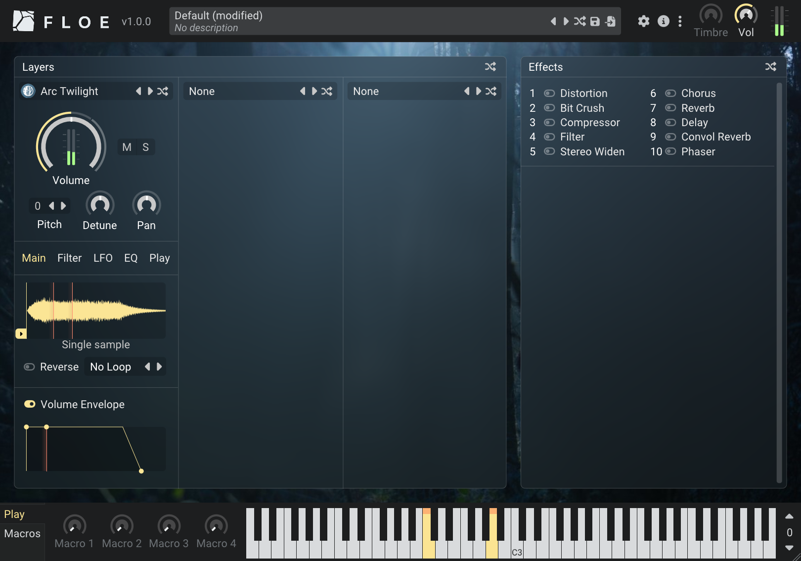
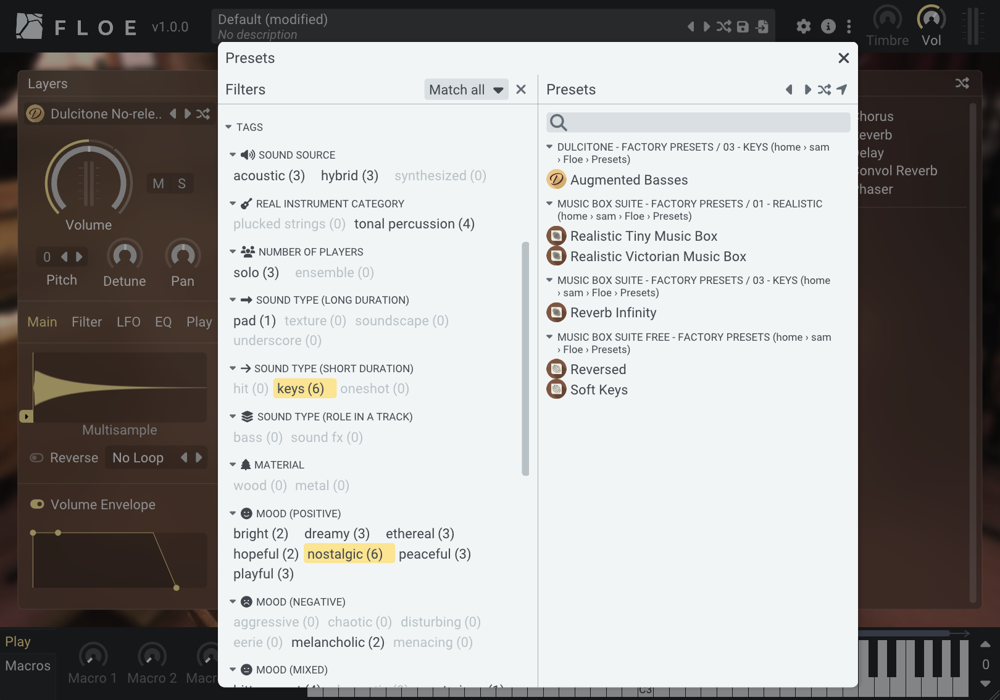
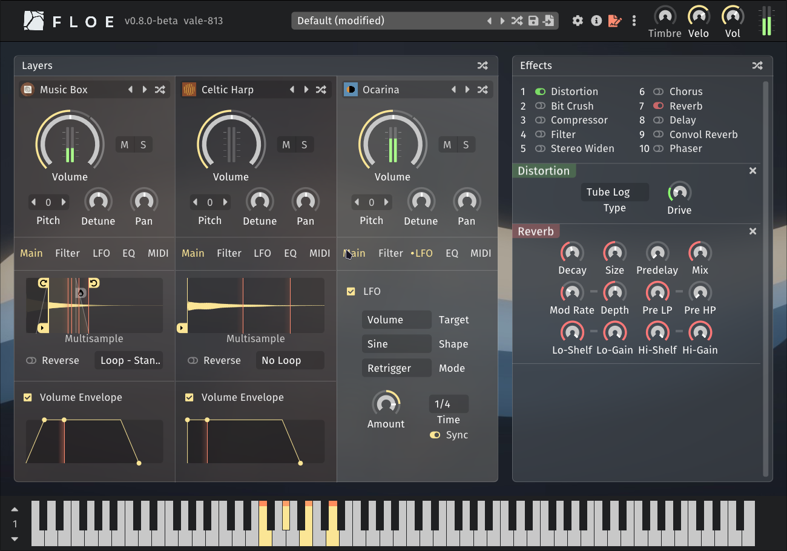
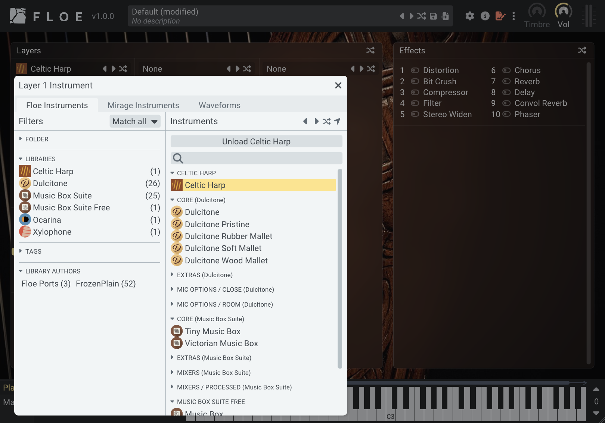

<!--
SPDX-FileCopyrightText: 2024 Sam Windell
SPDX-License-Identifier: GPL-3.0-or-later
-->

    <picture>
        <source media="(prefers-color-scheme: dark)" srcset="https://raw.githubusercontent.com/floe-audio/Floe-Logos/HEAD/horizontal_transparent.svg">
        <source media="(prefers-color-scheme: light)" srcset="https://raw.githubusercontent.com/floe-audio/Floe-Logos/HEAD/horizontal_transparent_dark.svg">
        
    </picture>

<h1 style="font-size: 3.1rem">Sound transformation at your fingertips</h1>

Floe empowers you to <strong>find</strong> the perfect sound across all your libraries, <strong>perform</strong> with expressive control, and <strong>transform</strong> samples beyond their natural boundaries. Completely free, open-source, and built for the long-term.

Floe is an audio plugin (CLAP, VST3, AU) for Windows, macOS and Linux that loads and plays sample libraries in the _Floe library_ format. More like a ROMpler or sample-based synthesiser than a traditional sampler, Floe is the **sample library platform** for virtual instrument products.

<a href="https://floe.audio/installation/download-and-install-floe.html" style="
  background-color: #555e85; 
  border: none; 
  border-radius: 4px; 
  color: white; 
  padding: 15px 32px; 
  text-align: center; 
  text-decoration: none; 
  display: inline-block; 
  font-size: 16px; 
  font-weight: bold; 
  margin: 4px 2px; 
  cursor: pointer; 
  box-shadow: 0 2px 5px rgba(0,0,0,0.2); 
  transition: all 0.3s ease;">Download Now</a>

## Consistent, powerful interface
Every library maintains a consistent, intuitive interface (each with its own background image) while offering powerful search capabilities, comprehensive preset systems, and macros that enable deep sound customisation. You can play sample-based instruments naturally, or transform them beyond their original nature using well-established sound-shaping tools.

Load a preset for a production-ready sound, then effortlessly tweak it to your liking. Explore inspiring sounds and understand how they work, or precisely find what you need using comprehensive search, tags, and organisation.

## Professional-grade indie software
Floe is a passion project by Sam Windell, a developer & sound-designer who also runs sample library company [FrozenPlain](https://frozenplain.com). Shaped by direct feedback from professional composers for film and television, it's not trying to be everything to everyone. Floe offers a curated, streamlined approach focused on what matters: performance, simplicity, and usability.

## Find the right sound quickly
Floe's intuitive browsing system works across all your Floe sample libraries, bringing together instruments and presets through extensive **categories**, standardised **tags** (by mood, timbre, type, etc.), and **search**. The sound you need is always a few clicks away.

## Built for the long-term
It's _complete_ but not _completed_ — containing all the essential parts of a great product, with continuous refinement and expansion over time. We have ambitious goals for the project while maintaining a commitment to backwards compatibility.

## Transform sounds
With three distinct layers, Floe lets you blend instruments across different libraries. Transform sounds with loop and crossfade controls that bridge the gap between multisampling and synthesis. Process the sounds further with a rack of ==effects-count== built-in effects.

## Focus on making music
Available as a plugin for your DAW (CLAP, VST3, and AU) on Windows, macOS and Linux. No accounts, no subscriptions, no interruptions — just musical creation. Openness is at the core of Floe and its libraries.

## Expanding library selection
The list of [libraries available](./packages/available-packages.md) for Floe is growing. And they're installable in a few clicks. 

Anyone can make [libraries](./usage/sample-libraries.md) for Floe and contribute to the project. By consolidating our efforts into improving this engine, we improve the capabilities of all of its libraries for everyone.

## Built on a solid foundation
Built on the proven architecture of FrozenPlain's Mirage, used in professional productions for years, Floe is the next evolution, designed with careful attention to reliability and performance. We're committed to further expanding its capabilities while maintaining backwards compatibility.

Already use Mirage? Read more about the [transition to Floe](./about-the-project/mirage.md).

## A platform for sample library instruments
Floe is a platform for professional sample library products with these 2 key features:
1. Ready-to-use presets (fine-tuned patches made using the library's instruments)
1. Direct access to sample-based instruments with sound-shaping tools for crafting your own variations: layering, looping, envelopes, effects, LFOs, macro-parameters, and more.

For now, importing your own custom samples requires creating a sample library (programming required).

Floe supports both multisampled and single-sample instruments.

## Why open-source?
Floe is built as open-source software, meaning its code is freely available for anyone to see, modify, and improve (it's GPL licensed). 

While this might seem like a technical detail, it offers some potentially very valuable benefits: 
- Any developer can pick it up and keep it running on future systems, ensuring longevity. 
- If you need a specific feature, you could hire a developer to create your own customised version.
- Most importantly, open-source transparency builds trust — you or any community developer can verify that the program genuinely serves meaningful music creation rather than employing dubious business tactics.

## About this website
This website contains everything you need to know about Floe. It's presented in a book-like format, with chapters in the sidebar. 

If you're viewing this online, you might find the search feature useful: open it by clicking the <i class="fa fa-search"></i> magnifying glass icon at the top-left of the page. Additionally, there is a <i class="fa fa-print"></i> print icon at the top-right for either printing this book, or saving it to a PDF.

