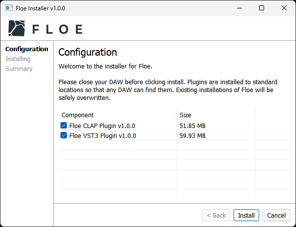
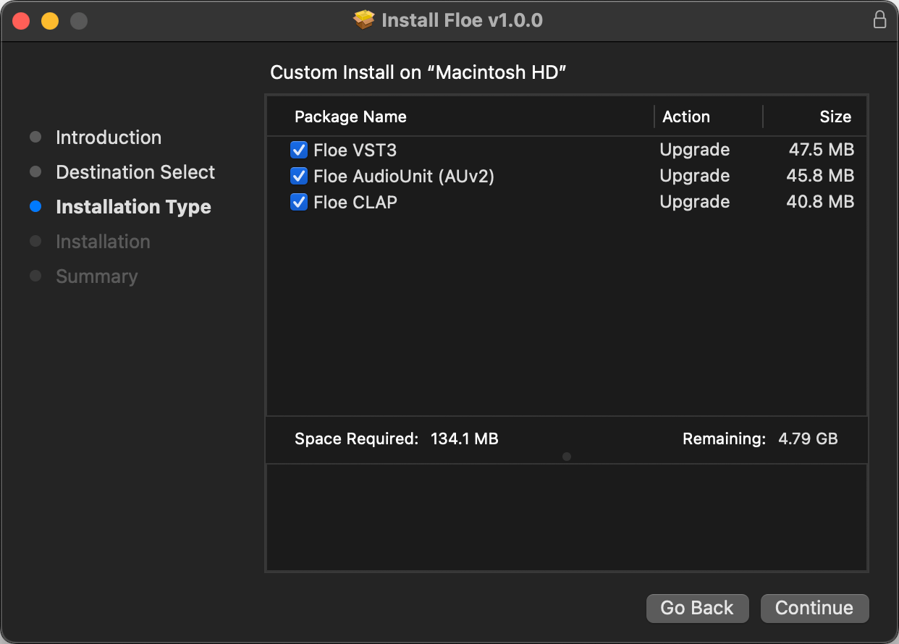

<!--
SPDX-FileCopyrightText: 2024 Sam Windell
SPDX-License-Identifier: GPL-3.0-or-later
-->

# Download & Install Floe

    

        <i class="fa fa-windows"></i>
        Windows
    

    

        <i class="fa fa-apple"></i>
        macOS
    

    

        <i class="fa fa-linux"></i>
        Linux
    

    

        

            
        

        

            <a href="==Floe-Installer-Windows-url==" class="download-button" data-umami-event="Download Windows Installer">
                <i class="fa fa-download"></i>Download Floe (==Floe-Installer-Windows-size==)
            </a>
        

        
<em>Current version: v==latest-release-version== • <a href="https://floe.audio/installation/requirements.html">Requirements</a></em>

        <h3>Manual Installation (advanced)</h3>
        
Normally you'll want to use the installer, but there could be some cases where you'd prefer to install Floe manually. To allow for this, we provide a zip file that contains Floe's plugin files. Extract it and move the files to your plugin folders.

        <blockquote>
            
<strong><i class="fa fa-windows"></i> Floe Manual Install Windows</strong>: <a href="==Floe-Manual-Install-Windows-url==" data-umami-event="Download Windows Manual Install">Download Floe-Manual-Install-Windows.zip</a> (==Floe-Manual-Install-Windows-size==)

        </blockquote>
        <ul>
            <li>CLAP: Move <code>Floe.clap</code> into <code>C:\Program Files\Common Files\CLAP</code></li>
            <li>VST3: Move <code>Floe.vst3</code> into <code>C:\Program Files\Common Files\VST3</code></li>
        </ul>
    

    

        

            
        

        

            <a href="==Floe-Installer-macOS-Apple-Silicon-url==" class="download-button" data-umami-event="Download macOS Apple Silicon Installer">
                <i class="fa fa-download"></i>Floe — Apple Silicon (==Floe-Installer-macOS-Apple-Silicon-size==)
            </a>
            <a href="==Floe-Installer-macOS-Intel-url==" class="download-button" data-umami-event="Download macOS Intel Installer">
                <i class="fa fa-download"></i>Floe — Intel (==Floe-Installer-macOS-Intel-size==)
            </a>
        

        
<em>Current version: v==latest-release-version== • <a href="https://floe.audio/installation/requirements.html">Requirements</a></em>

        <h3>Manual Installation (advanced)</h3>
        
Normally you'll want to use the installer, but there could be some cases where you'd prefer to install Floe manually. To allow for this, we provide a zip file that contains Floe's plugin files. Extract it and move the files to your plugin folders.

        <blockquote>
            
<strong><i class="fa fa-apple"></i> Floe Manual Install macOS Apple Silicon</strong>: <a href="==Floe-Manual-Install-macOS-Apple-Silicon-url==" data-umami-event="Download macOS Apple Silicon Manual Install">Download Floe-Manual-Install-macOS-Apple-Silicon.zip</a> (==Floe-Manual-Install-macOS-Apple-Silicon-size==)

            
<strong><i class="fa fa-apple"></i> Floe Manual Install macOS Intel</strong>: <a href="==Floe-Manual-Install-macOS-Intel-url==" data-umami-event="Download macOS Intel Manual Install">Download Floe-Manual-Install-macOS-Intel.zip</a> (==Floe-Manual-Install-macOS-Intel-size==)

        </blockquote>
        <ul>
            <li>CLAP: Move <code>Floe.clap</code> into <code>/Library/Audio/Plug-Ins/CLAP</code></li>
            <li>VST3: Move <code>Floe.vst3</code> into <code>/Library/Audio/Plug-Ins/VST3</code></li>
            <li>AU: Move <code>Floe.component</code> into <code>/Library/Audio/Plug-Ins/Components</code></li>
        </ul>
        <h3>Apple Silicon vs Intel</h3>
        
You must choose the right download for your machine. Most Macs since late 2020 use Apple Silicon chips (M1, M2, M3…) whereas most Macs before that use Intel chips. See <a href="https://support.apple.com/en-us/116943">Apple's documentation</a> for more information.

    

    

        
<em>Current version: v==latest-release-version== • <a href="https://floe.audio/installation/requirements.html">Requirements</a></em>

        
Run the following command in a terminal to install or update Floe.

        
For CLAP:

        <pre><code>mkdir -p ~/.clap && curl -L ==Floe-CLAP-Linux-url== | tar -xzf - -C ~/.clap</code></pre>
        
For VST3:

        <pre><code>mkdir -p ~/.vst3 && curl -L ==Floe-VST3-Linux-url== | tar -xzf - -C ~/.vst3</code></pre>
        <h3 style="margin-top: 100px;">Manual Installation (advanced)</h3>
        
Here's the download links if you want to install the plugins manually.

        <blockquote>
            
<strong><i class="fa fa-linux"></i> Floe Linux CLAP</strong>: <a href="==Floe-CLAP-Linux-url==" data-umami-event="Download Linux CLAP">Download Floe-CLAP-Linux.tar.gz</a> (==Floe-CLAP-Linux-size==)

            
<strong><i class="fa fa-linux"></i> Floe Linux VST3</strong>: <a href="==Floe-VST3-Linux-url==" data-umami-event="Download Linux VST3">Download Floe-VST3-Linux.tar.gz</a> (==Floe-VST3-Linux-size==)

        </blockquote>
        <ul>
            <li>CLAP: Move <code>Floe.clap</code> into <code>~/.clap</code> or <code>/usr/lib/clap</code></li>
            <li>VST3: Move <code>Floe.vst3</code> into <code>~/.vst3</code> or <code>/usr/lib/vst3</code> or <code>/usr/local/lib/vst3</code></li>
        </ul>
    

## More Information
Download the installer for your operating system using the buttons above. Double-click the downloaded file to extract it, and then double-click the extracted installer file to run it. It will guide you through the installation process including choosing which plugin formats to install.

You can replace old versions with new ones and everything will continue to work.

To update Floe, just download and run the latest installer again.

## What's Next?

Install sample libraries and presets via [packages](../packages/install-packages.md).

