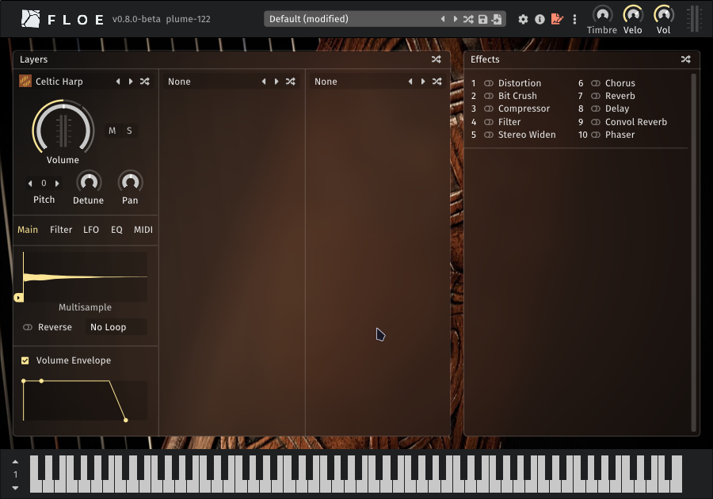
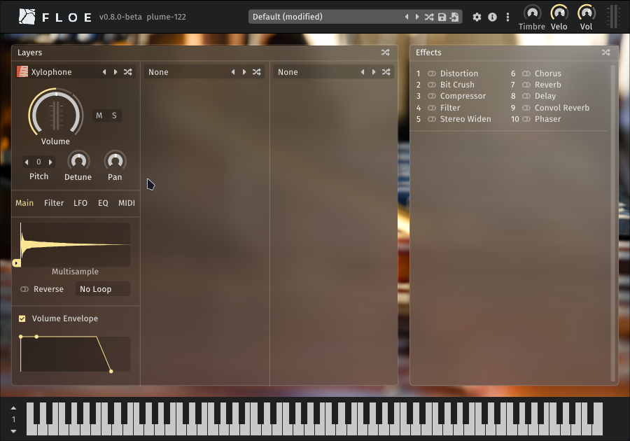
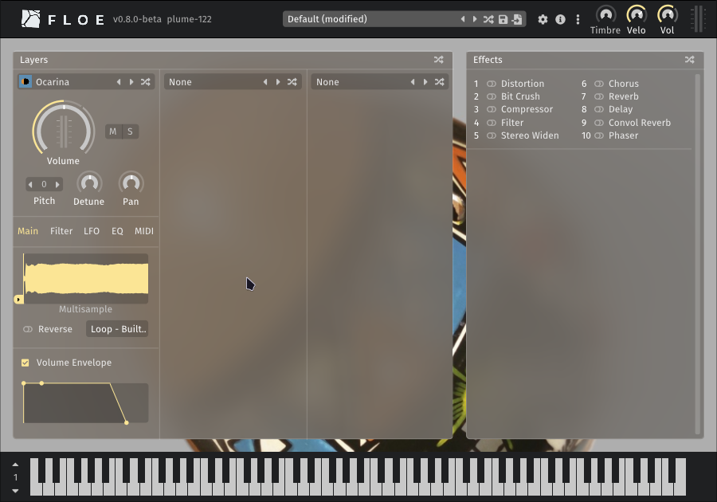
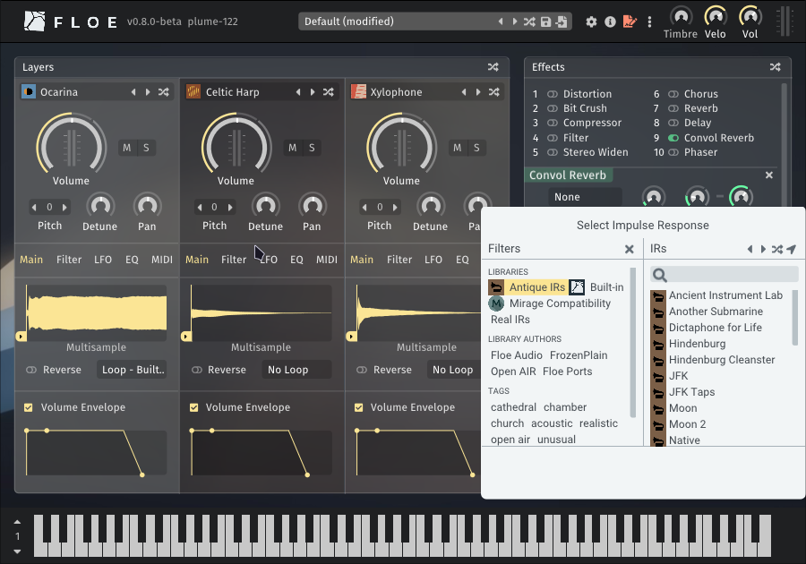
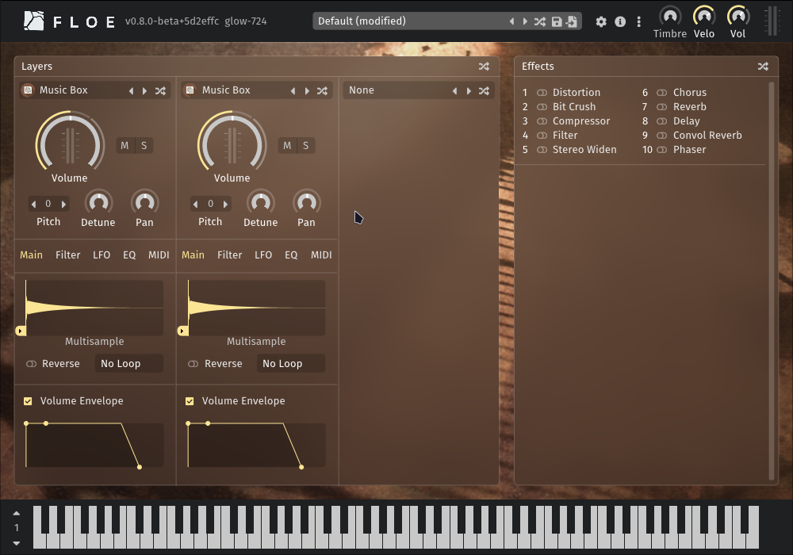

<!--
SPDX-FileCopyrightText: 2025 Sam Windell
SPDX-License-Identifier: GPL-3.0-or-later
-->

# Available Packages

Floe can [install](./install-packages.md) libraries and presets from ZIP files called _Floe packages_.

This page showcases packages to help you get started with Floe.

## Floe Ports (free)
_Floe Ports_ is the name we've given to the community project of converting high-quality libraries from other formats into Floe's native format. Reach out if you want to help with this project, we'd love more presets for these libraries and more libraries converted.

For developers: Floe Ports libraries are available on [Floe's GitHub](https://github.com/orgs/floe-audio/repositories).

These are currently very basic.

They have just 1 instrument each and no presets.

| Name | Details | Download |
|:--|:--|:--|
| **Celtic Harp** by Floe Ports  | High-quality multisampled harp with velocity layers and round robins. Port of [Etherealwinds Harp 2: Community Edition by Versilian Studios](https://versilian-studios.com/etherealwinds-harp/). *1 instrument, CC-BY (attribution required)* | [Download Package (120.4 MB)](https://github.com/floe-audio/Harp/releases/download/v1.5/Floe.Ports.-.Celtic.Harp.Package.zip) |
| **Xylophone** by Floe Ports  | Basic free multisampled xylophone from [FreePats](https://freepats.zenvoid.org/ChromaticPercussion/xylophone.html), converted into a Floe library. *1 instrument, public domain* | [Download Package (2.6 MB)](https://github.com/floe-audio/Xylophone/releases/download/v1.5/Floe.Ports.-.Xylophone.Package.zip) |
| **Ocarina** by Floe Ports  | Basic free ocarina from [FreePats](https://freepats.zenvoid.org/Wind/ocarina.html), converted into a Floe library. *1 instrument, public domain* | [Download Package (4.3 MB)](https://github.com/floe-audio/Ocarina/releases/download/v1.5/Floe.Ports.-.Ocarina.Package.zip) |
| **Antique IRs** by Floe Ports  | Impulse responses simulating old audio equipment (dicta-phones, film reels, vintage vinyl, wax cylinders). Port of [NoiseCollector's library](https://freesound.org/people/NoiseCollector/packs/11613/) from public domain historical recordings. *27 impulse responses, public domain* | [Download Package (1.1 MB)](https://github.com/floe-audio/Antique-IRs/releases/download/v1.0/Floe.Ports.-.Antique.IRs.Package.zip) |

## FrozenPlain Libraries

Floe fully supports all libraries from [FrozenPlain's](https://www.frozenplain.com) catalogue of professional sample libraries (except their Kontakt-format libraries).

| Name | Details | Download |
|:--|:--|:--|
| **Music Box Suite Free** by FrozenPlain  | Free multisampled music box from FrozenPlain. *1 instrument, 9 presets* | [Visit webpage →](https://www.frozenplain.com/product/music-box-suite-free)  |
| **Professional Library Catalogue** by FrozenPlain  | Range of professional sample libraries covering ambient, cinematic, and sound design. (Paid products). | [Browse FrozenPlain Libraries →](https://www.frozenplain.com/products?format=Mirage+Library%2CFloe+Library) |
| **Mirage Compatibility** by FrozenPlain | Required compatibility package for using FrozenPlain's [Mirage](../about-the-project/mirage.md) libraries inside Floe. | [Download Package (8.9 MB)](https://github.com/FrozenPlain/floe-mirage-compatibility/releases/download/v1.1/FrozenPlain.-.Mirage.Compatibility.Package.zip) |

---

<!-- we want to let developers know that they can add their own packages to this list -->
_If you have a Floe package that you would like to be listed here, please get in touch._
