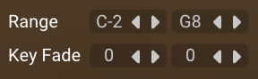
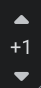
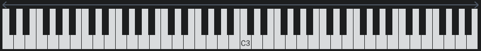
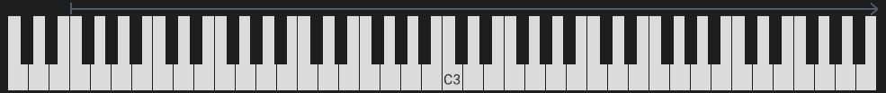
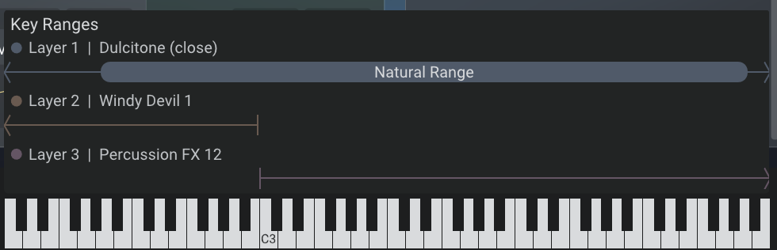
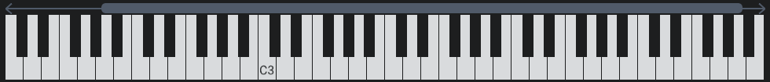
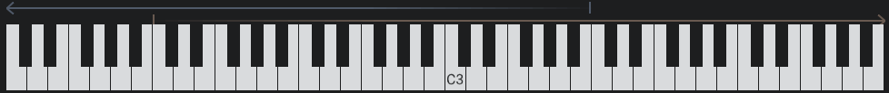

<!--
SPDX-FileCopyrightText: 2025 Sam Windell
SPDX-License-Identifier: GPL-3.0-or-later
-->

# Key Ranges

Key ranges let you split the keyboard into zones, with each layer responding to specific keys. This enables keyboard splits, layered zones, and smooth transitions between different sounds across the keyboard.

## Setting up key ranges

Configure key ranges on each layer's **Play tab** using the low and high key controls. Click and drag these handles to set the range that layer will respond to.

**Fade controls** let you create smooth transitions at the edges of key ranges. Set the number of notes that fade in at the start or fade out at the end of each range. This is used for creating seamless overlaps between layers.

For multisampled instruments in particular, consider using the **Transpose** parameter to change the pitch of the layer. This works by shifting the underlying mapping of samples so higher/lower samples are triggered as opposed to the standard pitch parameter which algorithmically re-pitches the sound.

## Key range display

The key range display appears as a bar above the keyboard at the bottom of the interface. It shows which keys trigger each layer, with colours corresponding to each layer. The display is hidden when all layers use the full keyboard range (C-2 to G8).

**Navigation**: Since 128 MIDI keys can't fit on screen, the keyboard shows a scrollable section. Use the octave scroll buttons or drag the octave number to navigate. The key range display scrolls with the keyboard.

**Layer visibility**: Only layers with loaded instruments appear in the display. Empty layers are not shown.

### Visual elements

**Off-screen indicators**: Small chevrons show when a range extends beyond the visible keyboard area. Scroll to see the full range.

**End markers**: Vertical lines mark the boundaries of each key range, moving as you adjust the range settings.

**Enlarged view**: Hover over the display to see an enlarged view with more detail.

**Named ranges**: Sample library developers can define named ranges for instruments (like drum names or natural vs. extended ranges). These appear as thicker capsules with labels visible in the enlarged view.

**Fade visualisation**: Gradients show fade-in and fade-out areas, with more transparency indicating lower volume.

