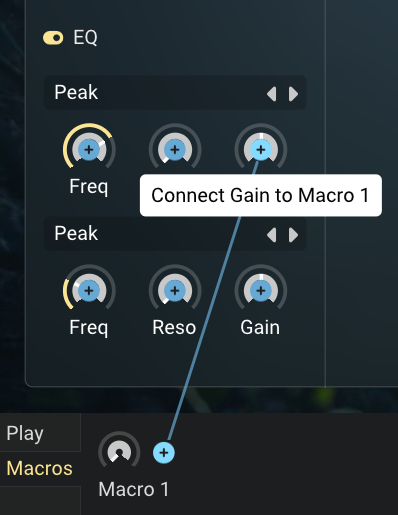
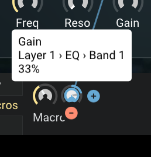
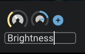

<!--
SPDX-FileCopyrightText: 2025 Sam Windell
SPDX-License-Identifier: GPL-3.0-or-later
-->

# Macros

## At a glance
- Control multiple parameters at once with a single knob.
- 4 macros available, each controlling up to 6 parameters.
- Perfect for expressive performance and creating custom controls.
- Found in the bottom panel: Play tab for performance, Macros tab for editing.

## What are macros?

Macros are powerful controls that let you move multiple parameters simultaneously with a single knob turn. Think of them as custom controls that you design to fit your musical needs. Instead of tweaking multiple knobs separately, you can create a macro that adjusts filter cutoff, reverb amount, and delay feedback all at once — perfect for dramatic breakdowns or smooth transitions.

Floe provides 4 macros, and each macro can control up to 6 different parameters. This gives you tremendous flexibility to create expressive, performance-ready controls that transform your sounds in musical ways.

## Setting up macros

<video width="60%" controls>
  <source src="../images/macros-workflow.mp4" type="video/mp4">
  Your browser does not support the video tag.
</video>

*Complete workflow: creating macro destinations, adjusting amounts, and renaming*

### Creating a macro destination

1. Navigate to the **Macros tab** in the bottom panel
2. Hover your mouse over any macro knob — a **plus icon** will appear
3. Click the plus icon to enter **destination selection mode**
4. All automatable parameters in Floe will now show plus icons
5. Click on any highlighted parameter to link it to your macro

### Adjusting macro strength

Once you've linked a parameter to a macro, a small knob appears next to the macro. This **destination amount knob** controls how much the macro affects that parameter.

- **Positive values**: Parameter increases when macro is turned up
- **Negative values**: Parameter decreases when macro is turned up (bi-directional control)
- **Strength**: Higher percentages create more dramatic changes

The macro's effect is relative to the parameter's current position, so you can set your base sound first, then use macros to perform variations around that starting point.

## Managing macros

### Removing destinations
To unlink a parameter from a macro:
1. Hover over the destination amount knob
2. A **minus icon** will appear below the knob
3. Click the minus icon to remove the connection

### Renaming macros
Give your macros meaningful names:
1. Go to the **Macros tab**
2. Click on the macro's name
3. Type your new name

### Using macros for performance
Switch to the **Play tab** for quick access to your macros during performance. This keeps your most expressive controls front and center while you're making music.

## For preset creators

If you're creating presets for others, macros are essential for making your sounds performance-ready. Well-designed macros turn static presets into dynamic, expressive instruments. Consider what aspects of the sound would be most musical to control, and create macros that enhance the emotional impact of the preset rather than just providing technical adjustments.

