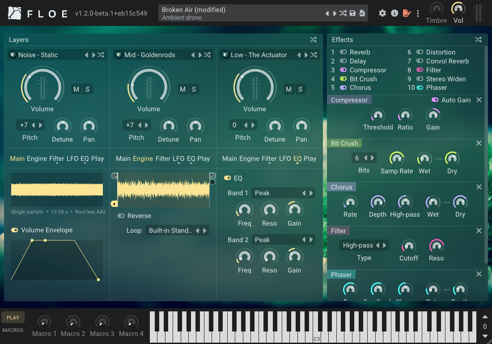

<!--
SPDX-FileCopyrightText: 2026 Sam Windell
SPDX-License-Identifier: CC-BY-SA-4.0
-->

Hi, Floe 1.2.0-beta.1 is out. This one's mostly GUI improvements - crisper visuals, better spacing, and various bits of polish. Behind the scenes there's been a massive restructuring of the GUI system ready for upcoming features. This is the first step towards the bigger 1.2 update.

<!-- truncate -->

This is a beta release, so it's best suited for those who are comfortable being on the cutting edge and don't mind the odd rough edge. If you'd rather play it safe, you can stick with the latest stable release and all of this will land there soon enough. More info on [beta testing here](/docs/about-the-project/beta-testing).

If you do give it a go, we'd love to hear how it's working for you. Grab it from the [download page](/download). Full [changelog here](/docs/changelog).
