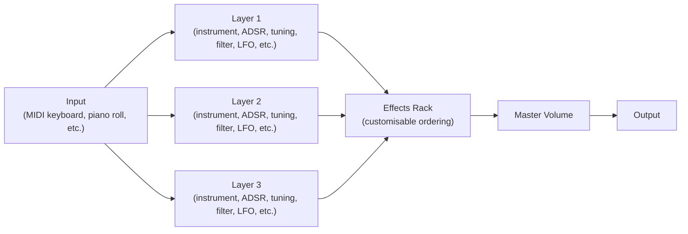

{/*
SPDX-FileCopyrightText: 2026 Sam Windell
SPDX-License-Identifier: CC-BY-SA-4.0
*/}

import GeneratedScreenshot from '@site/src/components/GeneratedScreenshot';

## What Floe is

Floe is an audio plugin for your digital audio workstation (DAW). It's a platform for performing, finding and transforming sounds from sample libraries — closer to a ROMpler or sample-based synth than a traditional sampler. It hosts sample-based [_instruments_](../reference/instruments) (sampled pianos, synths, textures, and so on) and exposes an extensive set of parameters for venturing into sample-based synthesis. A comprehensive presets system with powerful browsers, macros, a random variation generator, and other features make it a formidable engine for sample libraries.

Floe is designed to be efficient with your CPU and can be added multiple times in a single project; multiple instances will share resources such as sample libraries to keep memory usage low.

Floe is not designed for ad-hoc sampling — you can't currently import your own samples.

### New in version 2
The recent version 2 update of Floe offers a substantial set of new features and improvements. Read about the update in the [blog post](/blog/floe-2-0-0-beta-2).

## The UI

<GeneratedScreenshot name="overview" alt="Floe's main window with its four regions highlighted" />

1. **Top panel** — global controls: preset name and browser, save, undo/redo, the main menu, and master volume.
1. **Main content** — one of 3 tabs. [_Perform_](../usage/perform.mdx) shows the distraction-free basic view, [_Layers_](../usage/layers.mdx) exposes the per-layer parameters for each of the three layers, and [_Effects_](../usage/effects.mdx) is the reorderable effects rack.
1. **Bottom panel** — the keyboard, plus context-sensitive controls (key ranges, macros, etc.) depending on the active tab.
1. **Main tabs** — switches the main content between _Perform_, _Layers_, and _Effects_.
1. **Resize corner** — drag to scale the window (fixed aspect ratio). The _window size_ buttons in the <FAIcon icon="fa-solid fa-cog" /> preferences panel do the same. In some DAWs such as Logic Pro, you must grab this exact point of Floe, not the corner of DAW window wrapping it.

## Signal flow

Notes are sent in parallel to three identical layers, each hosting its own instrument with per-layer envelope, tuning, filter and LFO. The layers are summed and fed through a shared, reorderable effects rack, then a master volume.

## Tips
- Knobs and sliders respond to click-and-drag (up/down or left/right). Hold `shift` for fine adjustments, `ctrl`/`cmd`+click to reset to default, double-click to type a value, and right-click for more options.
- Hovering over most elements displays a tooltip with a brief description. Tooltips can be disabled in the <FAIcon icon="fa-solid fa-cog" /> preferences panel.
- Set up Floe to work with your MIDI controller by following the instructions on the [MIDI](../usage/midi) page.
