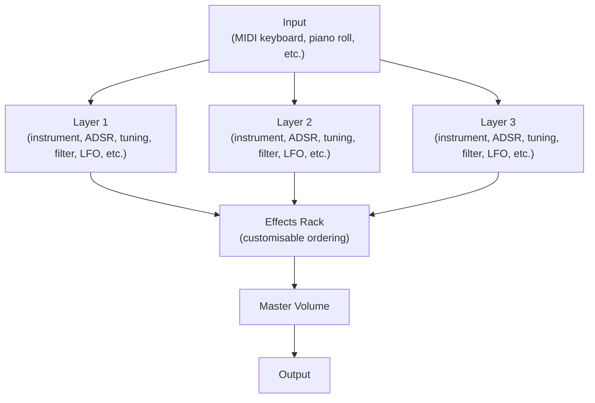

<!--
SPDX-FileCopyrightText: 2025 Sam Windell
SPDX-License-Identifier: CC-BY-SA-4.0
-->

import NumberedOverlay from '@site/src/components/NumberedOverlay';

At the core of Floe are the 3 independent layers, each with their own instrument and sound-shaping options. This structure allows for blending multiple sounds together to create dynamic, rich, and complex tones.

These are displayed in three columns starting from the left of the main panel. Each layer is identical. Floe’s layers are the first things in the processing chain; each layer is processed in parallel, and then the three streams of audio are mixed together and fed through the effects rack, from top to bottom.

When you play a note into Floe, all layers are triggered simultaneously.

## Top Controls

A permanent fixture on each layer are the top controls, which provide quick access to key functions.

<NumberedOverlay
  src="/images/layer-top-controls.png"
  alt="Layer Top Controls"
  overlays={[
    { number: 1, top: '3%', left: '50%' },
    { number: 2, top: '10%', left: '80%' },
    { number: 3, top: '45%', left: '71%' },
  ]}
/>

- **1**: the _instrument_ selector: click this to open the [picker panel](/docs/key-concepts/picker-panels) and select a new instrument for this layer - or unload the current one. You can also right-click and choose 'Unload' from the menu.
- **2**: instrument navigation: left/right arrows to quickly switch between instruments, and a randomise button to load a random instrument. These buttons are based on the current filter settings in the picker panel. For example, if you have selected the 'Distant Signals' sample library on the picker's filters, the navigation buttons will only cycle through instruments from that library.
- **3**: mute/solo buttons: buttons to mute or solo this layer. Soloing a layer automatically mutes the other two layers.
- **Volume**: adjust the layer's output volume.
- **Pitch**: adjust the layer's pitch in semitones. Double click the number to type in a precise value. Or click and drag to change the value, or use the left/right buttons.
- **Detune**: adjust the layer's pitch in cents (hundredths of a semitone).
- **Pan**: adjust the layer's stereo position. Uses a constant power pan law (AKA -3dB centre).

## Main Tab

The main tab contains the core sample playback and volume envelope controls for this layer.

<NumberedOverlay
  src="/images/layer-main.png"
  alt="Layer Main Tab"
  overlays={[
    { number: 1, top: '20%', left: '46%' },
    { number: 2, top: '38%', left: '0%' },
    { number: 3, top: '48%', left: '72%' },
    { number: 4, top: '81%', left: '46%' },
  ]}
/>

- **1**: sample controls: this is a multi-use control that displays the waveform and voice markers, but also provides an overlay for sample-start, looping, and reverse indication. Please visit the [looping](/docs/usage/looping) page for further about the loop controls. Below the waveform is a caption: _multisample_ or _single sample_; this is determined by the instrument loaded in this layer. An instrument that is made up of multiple samples has a representative waveform image, whereas a single-sample instrument shows the actual waveform of the sample. When you play a note, you will see red voice markers track across the waveform.
- **2**: sample start position: adjust where in the sample playback starts, this is expressed as a percentage of the sample's total length. Remember that if the instrument is a multisample, this control affects all samples in the instrument and the waveform is just a representation. It's typically a good idea to add a small attack using the volume envelope to avoid clicks if you change the sample start position.
- **Reverse**: toggle to play the sample(s) in reverse.
- **3**: loop mode: select the looping mode for this layer. Visit the [looping](/docs/usage/looping) page for full details.
- **Volume Envelope on/off**: typically it's best to leave the volume envelope enabled, but in some situations you can turn it off to allow samples to play unaltered in their entirety.
- **4**: volume envelope ADSR: this UI element has 3 draggable points representing Attack, Decay+Sustain, and Release. Use these to shape this layer's voices volume over time. As with all controls, hold `shift` for fine adjustments.

## Filter Tab

Each voice belonging to this layer can be processed by a filter to shape its frequency content.

<NumberedOverlay
  src="/images/layer-filter.png"
  alt="Layer Filter Tab"
  overlays={[
    { number: 1, top: '20%', left: '71%' },
    { number: 2, top: '63%', left: '46%' },
  ]}
/>

- **Filter on/off**: toggle to enable or disable the filter for this layer.
- **1**: filter type selector: click to open a menu of available filter types such as low-pass, high-pass, band-pass.
- **Cutoff**: adjust the filter's cutoff frequency. 
- **Reso**: adjust the filter's resonance (emphasis around the cutoff frequency).
- **Envelope**: this bi-directional control adjusts how much the filter's cutoff is modulated by the envelop control below it. At the middle position, 0%, the envelope has no effect. Positive values cause the cutoff to open up as the envelope progresses, whereas negative values cause the cutoff to close down as the envelope progresses.
- **2**: filter envelope ADSR: in the exact same manner as the volume envelope, this control has 3 draggable points representing Attack, Decay+Sustain, and Release. Use these to shape how the filter's cutoff frequency changes over time alongside the _Envelope_ control above it.

## EQ Tab

Each layer includes a simple 2-band equalizer to sculpt the frequency content of the audio.

<NumberedOverlay
  src="/images/layer-eq.png"
  alt="Layer EQ Tab"
  overlays={[
    { number: 1, top: '31.5%', left: '26%' },
  ]}
/>

- **EQ on/off**: toggle to enable or disable the equaliser effect for this layer.

Both bands have the same controls:
- **1**: band type selector: click to open a menu of available EQ band types such as peak, low shelf, high shelf.
- **Freq**: adjust the center frequency of the EQ band.
- **Reso**: adjust the resonance (Q factor) of the EQ band, controlling how narrow or wide the frequency band is.
- **Gain**: this bi-directional controls adjusts the gain (boost or cut) applied at the frequency.

## LFO Tab

The Low Frequency Oscillator (LFO) can modulate various parameters to add movement and interest to the sound.

- **LFO on/off**: enable/disable the Low Frequency Oscillator (LFO).
- **Target**: select the parameter that the LFO will modulate from the dropdown menu. If you select the Filter, make you have the filter enabled on this layer.
- **Shape**: choose the LFO waveform shape such as sine, triangle, square.
- **Mode**: switch between 2 modes: _retrigger_ — where new notes always start with the LFO at the beginning of its cycle, and _free_ — where the LFO runs continuously regardless of note events, allowing for all notes to share the same LFO phase.
- **Amount**: control the intensity of the LFO effect on the target parameter.
- **Time**: adjust the LFO rate. When Sync is enabled, this is synced to the host tempo (e.g., 1/4 note). When disabled, it operates in Hz.
- **Sync**: toggle to sync the LFO speed to the host tempo.

## Play Tab

The Play tab contains MIDI and playback behavior settings for this layer.

- **Transpose**: transpose the mapping of samples by the given semitone offset. This is particularly useful for multi-sampled instruments as it triggers different samples rather than algorithmically pitch-shifting the audio (which is what layer's top control _pitch_ does).
- **Pitch Bend Range**: set the pitch range in semitones for the MIDI pitch wheel.
- **Keytrack**: when enabled, tunes the sound to match the key played. When disabled, the sound always plays at its root pitch regardless of the MIDI note. This is not typically useful if the instrument is multi-sampled.
- **Monophonic**: when enabled, only allows one voice of this layer to play at a time (monophonic behavior) - any preceeding note is ended, triggering it's volume envelope Release section. When disabled, multiple voices can play simultaneously (polyphonic behavior).
- **Range** and **Key Fade**: visit the [key ranges](/docs/usage/key-ranges) page for full details about these settings.
- **Velocity to volume curve**: graphical control showing how MIDI velocity affects the layer's volume. The curve can be adjusted to create different velocity response characteristics. Visit the [MIDI](/docs/usage/midi) page for full details about editing velocity curves.
